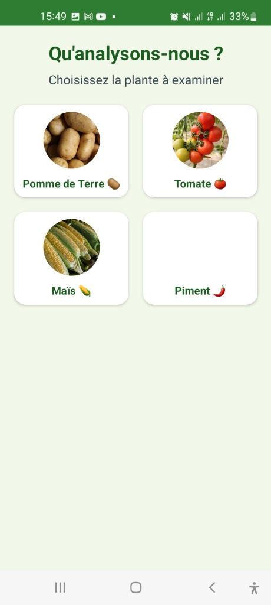
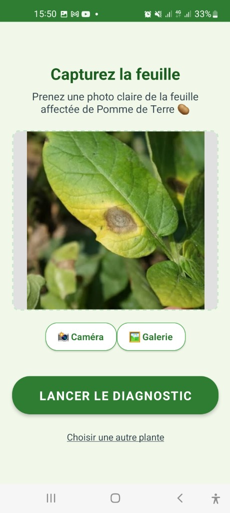
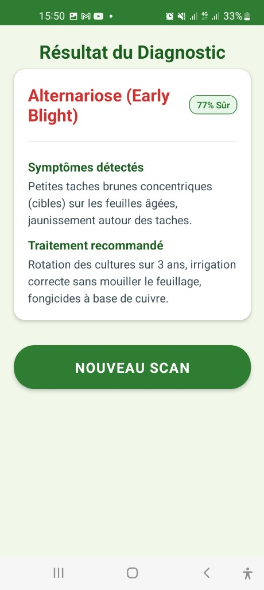

# Agri-Scan Niger 🌿

[](https://fastapi.tiangolo.com/)
[](https://www.tensorflow.org/)
[](https://reactnative.dev/)
[](https://www.docker.com/)

**Agri-Scan Niger** est une plate-forme intelligente dédiée à la détection précoce des maladies des cultures au Niger. Utilisant l'intelligence artificielle (Deep Learning), elle permet aux agriculteurs et techniciens agricoles d'identifier instantanément les pathologies des plantes à partir d'une simple photo.

## 🚀 Fonctionnalités Clés

- **Détection IA en temps réel** : Identification des maladies (mildiou précoce, mildiou tardif, sain) avec un indice de confiance élevé.
- **Application Mobile** : Une interface React Native fluide pour une utilisation sur le terrain.
- **Tableau de Bord Web** : Interface web pour une analyse détaillée et la gestion des données.
- **API Performante** : Backend FastAPI optimisé pour le service de modèles TensorFlow/Keras.
- **Déploiement Conteneurisé** : Architecture prête pour le cloud via Docker et Docker Compose.

### 📱 Aperçu de l'interface mobile

| 🌿 Sélection de la plante | 📸 Capture & Analyse | 📋 Résultat du Diagnostic |
| :---: | :---: | :---: |
|  |  |  |

> *L'interface utilisateur a été conçue pour être intuitive et accessible, permettant un diagnostic en 3 étapes simples.*

## 🏗️ Architecture du Projet

Le dépôt est structuré de la manière suivante :

- **[`Api/`](./Api)** : Backend Python (FastAPI) gérant le traitement d'images et les prédictions IA.
- **[`mobile-app/`](./mobile-app)** : Application mobile multiplateforme développée en React Native.
- **[`frontend/`](./frontend)** : Application web React pour la visualisation.
- **[`models/`](./models)** : Contient les modèles entraînés (format `.keras`).
- **[`data/`](./data)** : (Optionnel) Jeux de données utilisés pour l'entraînement ou les tests.

## 🛠️ Stack Technique

- **Backend** : FastAPI, Uvicorn, TensorFlow 2.x, Pillow.
- **Mobile** : React Native, Axios, React Navigation.
- **Web** : React.js, Material-UI.
- **DevOps** : Docker, Docker Compose, Azure ACI (CI/CD prêt).

## 📥 Installation et Configuration

### 1. Prérequis
- Python 3.9+
- Node.js & npm
- Docker & Docker Compose (Recommandé)

### 2. Backend (API)
```bash
cd Api
pip install -r requirements.txt
python main.py
```
L'API sera accessible sur `http://localhost:8000`.

### 3. Application Mobile
```bash
cd mobile-app
npm install
npx react-native start
# Dans un autre terminal
npx react-native run-android # ou run-ios
```

### 4. Frontend Web
```bash
cd frontend
npm install
npm start
```

### 5. Utilisation avec Docker
Pour lancer l'ensemble de l'écosystème :
```bash
docker-compose up --build
```

## 📸 Aperçu de l'Utilisation

L'API expose un endpoint `/predict` qui reçoit une image et retourne un JSON :
```json
{
  "class": "Late Blight",
  "confidence": 0.982
}
```

## 🤝 Contribution

Les contributions sont les bienvenues ! N'hésitez pas à ouvrir une *Issue* ou à soumettre une *Pull Request*.

## 📄 Licence
Ce projet est sous licence MIT. Voir le fichier [LICENSE](LICENSE) pour plus de détails.

---
*Développé avec ❤️ pour l'agriculture nigérienne par [GremahTech](https://github.com/GremahTech).*
